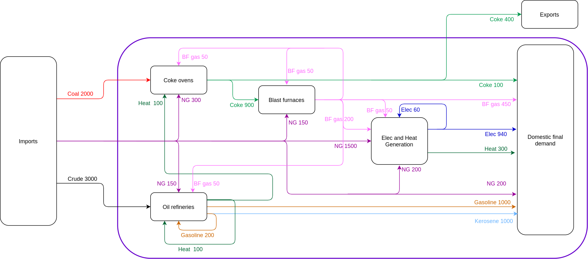

```{r, include = FALSE}
knitr::opts_chunk$set(
  collapse = TRUE,
  comment = "#>"
)
```

```{r setup, include = FALSE}
library(dplyr)
library(Recca)
library(ECCTools)
library(EROITools)
```

# Introduction

The `R` package `EROITools` provides tools to aggregate Energy Return On Investment (EROI) values previously calculated using a Physical Supply Use Table (PSUT) framework to represent the Energy Conversion Chain (see @Heun:2018). Previous to using the `EROITools` package, the World Energy Extended Balances (WEEB) from the International Energy Agency (IEA) can be loaded and tidied using the `IEATools` and `ECCTools` `R` packages. The `Recca` `R` package then allows analysts to calculate a wide range of EROIs at the product and industry levels, and the `EROITools` package provides tools aggregate the calculated EROIs by product group. Important features of the `EROITools` package include the following:

* Aggregations can be performed either at the global or national level;
* Aggregations can be performed at both the primary and final stage of energy use, but also at the **useful** stage of energy use providing that final-to-useful efficiencies are provided by the analyst for each energy product;
* At the useful stage, the package also allows analysts to conduct these aggregations respecting sectoral or end-use breakdowns, so that the average useful stage EROI of a product group can be calculated for a given final demand sector (for instance steelmaking) or for a given end-use category (for instance high temperature heating);
* Last, the package allows analysts to add additional energy requirements (supposing that these are provided by the analyst) that cannot be quantified using the IEA's WEEB such as supply chain energy requirements --- see @brockwayEstimationGlobalFinalstage2019 or @brandcorreaDevelopingInputOutputBased2017 for examples of a quantification of such indirect energy flows.


# Available vignettes

The vignettes available for this package detail how to conduct the following tasks:

1.  [Aggregating EROIs by fossil fuel group](Aggregating.html): Shows how EROIs can be aggregated by fossil fuel group at the primary, final, and useful energy stages. The product-level EROIs need to have been calculated and extracted first as described in the subsequent example section.
2.  [Breaking down useful stage EROIs by sector or end-use](Breakdown.html): Shows how to calculate useful stage EROIs while respecting a breakdown either by final demand sector or end-use category.
3.  [Adding indirect or other energy requirements](Indirect_Energy.html): Shows how indirect or other energy requirements can be added to the EROI calculations.


# Example for vignettes: the AB world

We use the same example than the one used to describe the `ECCTools` package: welcome back to the fictitious AB world (consisting of country A and country B)!


## Country A

The Energy Conversion Chain of country A is shown in the figure below:


## Country B

Next figure shows the Energy Conversion Chain of country B.




## Tidy AB data

Let's now have a look to the AB data organised in a `.tidy_iea_df` as provided by the `ECCTools` package.

```{r}
# Fix product-level balances within each country
ECCTools::tidy_AB_data %>% 
  dplyr::glimpse()
```


## Calculation of product-level EROIs

### Domestic Technology Assumption

Let us first modify the Energy Conversion Chain to make it compliant with the Domestic Technology Assumption (see the vignettes of the `ECCTools` package for more information --- the basic idea is to avoid taking into consideration imports in the supply mix of a given country).


```{r}
# Transforming Energy Conversion Chain to Domestic Technology Assumption
tidy_AB_dta <- ECCTools::tidy_AB_data %>%
  IEATools::add_psut_matnames() %>% 
  ECCTools::transform_to_dta(requirement_matrices_list = c("U_feed"),
                               select_dta_observations = FALSE) %>% 
  dplyr::glimpse()
```

Then, we construct the Input-Output matrices needed to conduct the calculations.

```{r}
# Calculating associated Input-Output matrices
tidy_io_AB_dta <- tidy_AB_dta %>%
  IEATools::prep_psut() %>%
  Recca::calc_io_mats(method_q_calculation = "sum_R_V_cols") %>% 
  dplyr::glimpse()
```

Then, we calculate the product-level EROIs in a matrix format.

```{r}
# Calculating EROI vectors (matrix format)
tidy_AB_erois_matrices_dta <- tidy_io_AB_dta %>%
  Recca::calc_E_EIOU() %>%
  Recca::calc_erois() %>% 
  dplyr::glimpse()
```

Last, we can drop the matrix format and extract the product-level EROIs in a tidy data frame format.

```{r}
# Extracting EROI values to a tidy data frame format
tidy_AB_erois_dta <- tidy_AB_erois_matrices_dta %>%
  EROITools::extract_tidy_product_erois() %>%
  dplyr::mutate(
    Eroi.method = "DTA"
  ) %>%
  dplyr::relocate(tidyselect::all_of("Eroi.method"), .after = Year) %>%
  dplyr::glimpse()
```


### Global Market Assumption

Alternatively, we can modify the Energy Conversion Chain to describe energy flows across countries using a Multi-Regional Physical Supply Use Table framework (see @mr_psut_paper). For the sake of simplicity, we use here the Global Market Assumption to demonstrate calculations with the multi-regional framework.

```{r}
# Transforming Energy Conversion Chain to Global Market Assumption
tidy_AB_data_gma <- ECCTools::tidy_AB_data %>%
  IEATools::add_psut_matnames() %>%
  ECCTools::transform_to_gma() %>%
  dplyr::glimpse()
```

Then, we construct the Input-Output matrices needed to conduct the calculations.

```{r}
# Calculating associated Input-Output matrices
tidy_io_AB_gma <- tidy_AB_data_gma %>%
  IEATools::prep_psut() %>%
  Recca::calc_io_mats(method_q_calculation = "sum_R_V_cols") %>% 
  dplyr::glimpse()
```

Then, we calculate the product-level EROIs in a matric format.

```{r}
# Calculating EROI vectors (matrix format)
tidy_AB_erois_matrices_gma <- tidy_io_AB_gma %>%
  Recca::calc_E_EIOU() %>%
  Recca::calc_erois() %>%
  dplyr::glimpse()
```

Last, we can drop the matrix format and extract the product-level EROIs in a tidy data frame format.

```{r}
# Extracting EROI values to a tidy data frame format
tidy_AB_erois_gma <- tidy_AB_erois_matrices_gma %>%
  EROITools::extract_tidy_product_erois() %>%
  dplyr::mutate(
    Eroi.method = "GMA"
  ) %>%
  dplyr::relocate(tidyselect::all_of("Eroi.method"), .after = Year) %>%
  dplyr::glimpse()
```

It can be seen that in the Global Market Assumption, there is only one region ("World"), and that the EROI of each product is specified in function of the region of **production** (not consumption!) of the product --- information contained in the product name ("Product" column).

The rest of the vignettes will demonstrate the `EROITools` package based on the `tidy_AB_erois_dta` and `tidy_AB_erois_gma` data frames.

## References
